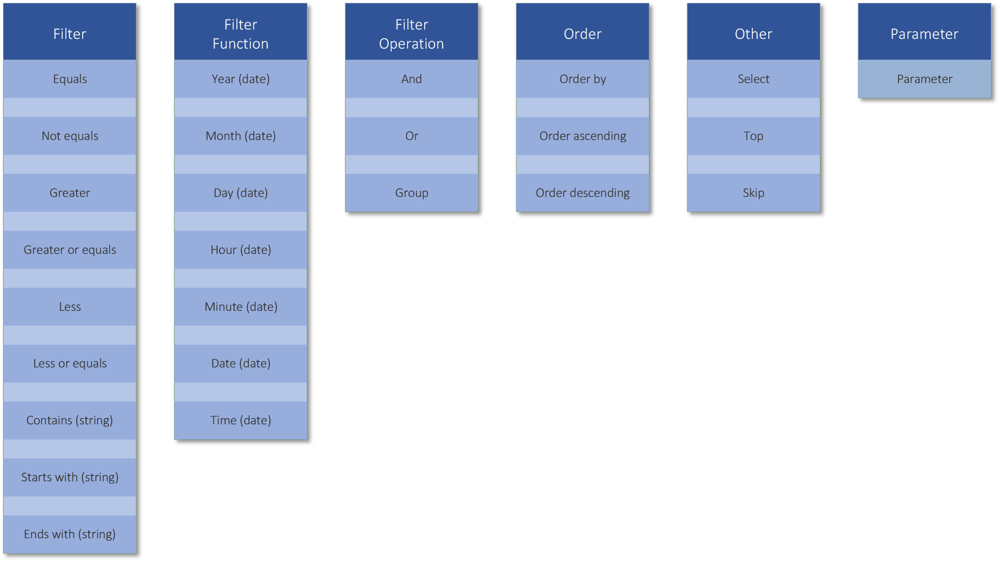

# Payroll Engine Client Tutorials - Build data query

## Overview
Tutorial topic: Build advanced data queries

## Prerequisites
- Payroll Engine Backend running with known tenant
- Visual Studio with .NET 8
- Tutorial: Console Application

## Query Parameters

  

## Learnings
- Employees query
- Limited count query
- By name query
- By attribute value query
