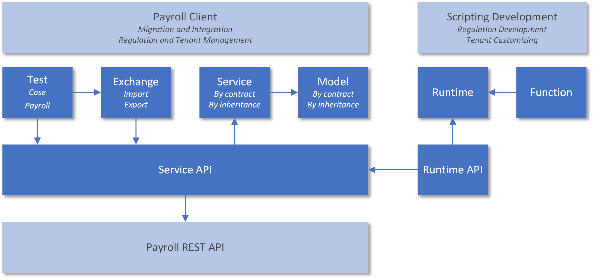

# Payroll Engine Client Tutorials - Hello Payroll Engine World!

## Welcome

This is the start of a tutorial series for developers showing how to create Payroll Engine Clients.

## Overview

Tutorial topic: Connect to the Payroll Engine Payroll API.

## Prerequisites

- Payroll Engine Backend running
- Visual Studio with .NET 7

## Learnings

- Payroll Engine Client Services
- Minimal .NET console application
- Payroll Engine the Payroll NuGet
- Connect to the Payroll API

## Notes

- Welcome - tuorial slide
	- Introduction Payroll Engine Client Services Tutorials
		- series of tutorial videos
	- GitLab repo: PayrollEngine.Client.Tutorials
- Prerequisites
	- Payroll Engine Backend
		- URL
		- Endpoints by groups
		- Endpoint-Reference (PayrollRestServicesEndpoints.xlsx)
	- Visual Studio
		- VS Community edition
		- .NET 7 or newer

## Payroll Engine Client Services

  

- Client Services
	- Example of a payroll client
	- Model, Service, Exchange and Test
- Mininal .NET console application
	- File > New > Project > Console App C#
		- Name: HelloPayrollEngineWorld
		- Framework: .NET 7
		- Do not use top-level statements: check
	- Edit HelloPayrollEngineWorld.csproj
		- remove ImplicitUsings and Nullable
		- add using System;
- Payroll Engine Payroll NuGet
	- Visual Studio Setup
		- Tools > Options > NuGet Package Manager > Packages Sources > Ensure Payroll Engine source
	- Install Payroll Engine NuGet
		- Provided by the backend
			- By version (PayrollEngine.Client.Services.<Version>.nupkg)
			- Including pre releases
		- Manage NuGet Packages...
			- Payroll Engine NuGet packages source
			- Include prerelease: check
			- PayrollEngine.Client.Services > Install
			- Show installed packages
			- Package updates
	- Content
		- Client Services HTML help, requires Microsoft HTML Help
		- JSON schemas for case test and exchange
	- Client services sub packages
- Connect to the Payroll API
	- new PayrollHttpClient with fixed arguments
		- Handles GET/POST/PUT/DELETE requests
		- Disposable: using
		- Single application instance
	- test connection with PayrollHttpClient.IsConnectionAvailable
		- show Hello Payroll Engine World!
		- wait for 'press any key'
