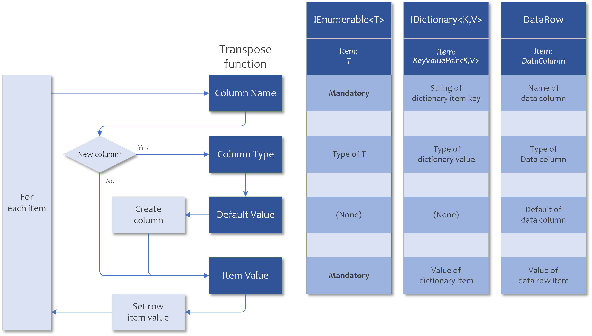

# Payroll Engine Client Tutorials - Transform report data

## Overview
Tutorial topic: Transform report queries to data sets

## Prerequisites
- Payroll Engine Backend running with known tenant
- Visual Studio with .NET 8
- Tutorial: Console Application

## Data Row Transpose

  

## Learnings
- Execute a report query
- Transpose query data manual
- Transpose query dictionary
